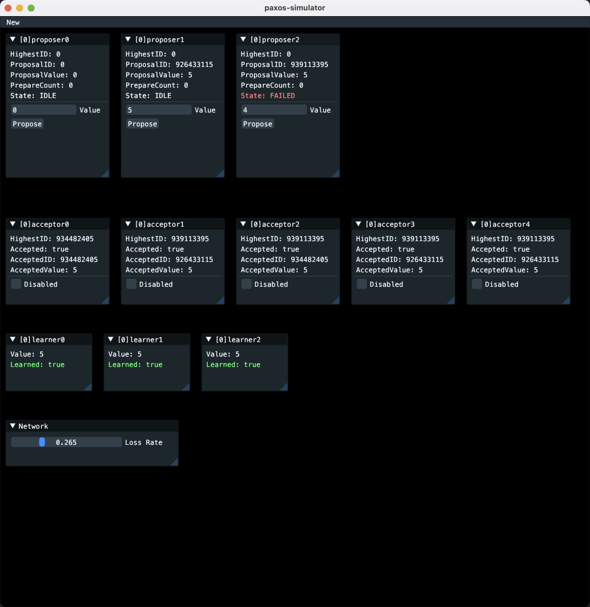

# Paxos Simulator



A simple simulator for the Paxos consensus algorithm which visualizes the state of each node in the network. Nodes communicate with each other by sending messages through a golang-channel-network, which supports loss rate and delay.

## Roles

- Proposer
- Acceptor
- Learner

## Run

Visualization base on [giu](https://github.com/AllenDang/giu), you may need to read the [installation guide](https://github.com/AllenDang/giu/tree/master?tab=readme-ov-file#install) to make it work.

And then

```bash
go run cmd/main.go
```
